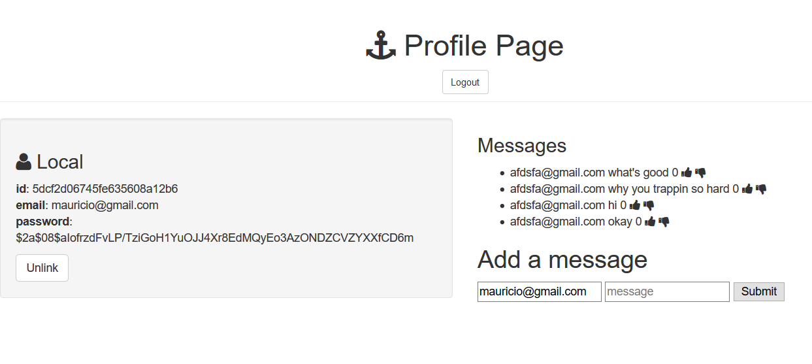

### Full Stack App Demonstration with user login

# Goal: Create full stack app that will let user add, change, delete, and see information from a database as well as log in to be able to interact with the message board
## How it's done:
- Server is set up to be able to handle requests that come from browser side JS and forms
- Index.ejs page is made that links to login and sing up pages
- Log in page has fields for email and password, once entered, a password check is made against the database using a passport module
- If successful, a redirect is made to the comments page using the users credentials to get in
- If not successful an error message appears on the screen
- Sign up page has similar operations to check if a user exists, if not it will create an encrypted password for them and a spot in a users collection
- Form is set up that has a field for topic and comment
- When a submission is sent in, a post request is made to the server which in turn takes the body of the request and stores it in a database, the page is then reloaded
- Each comment is created with icons for upvoting, downvoting, and deletion
- All icons have event listeners that will act based on request, they will make either put or delete requests to the server which will in turn change the database
# Installation

1. Clone repo
2. run `npm install`

# Usage

1. run `node server.js`
2. Navigate to `localhost:8080`

# Credit

Modified from Scotch.io's auth tutorial
